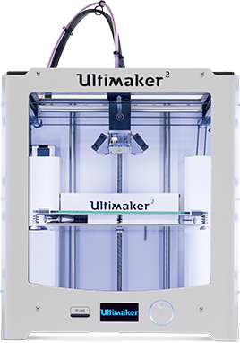
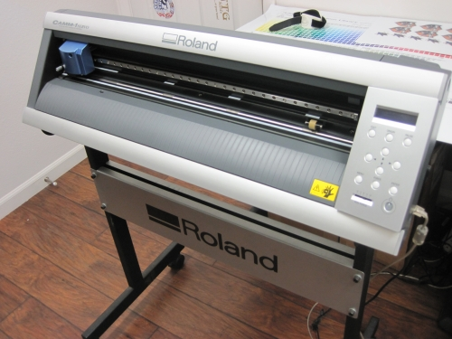
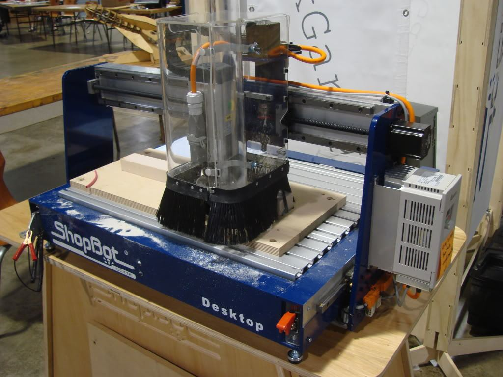

# MUHAMMED SHIYAS P P  
## About Me  
I am a Mechanical engineering student pursuing from MESCE Kuttipuram under Calicut University.Iam doing an intermediate course on fablab and I would like share my experiences in this page. contact: 
ph:+91 9633700929 
mail:mohdshiyaspp@gmail.com 
fb:<a href="https://www.facebook.com/mohdshiyas41"> mshiyas </a>
  
## Introduction to fablab 
fablab AKA fabrication lab is the new phase of manufacturing industries.By the use of fablab we can convert a large scale industry into small scale with high quality prOduct and more profit.  
## Syllabus:

Day 1 : Introduction to Fablab 

Day 2 : Github Pages and Documentation

Day 3 : 3D Printing
                                
Day 5 : Laser Cutting,Moulding and Casting
                               
Day 6 : Electronics Production and CNC
                                
Day 7 : Vinyl Cutting & Screen Printing
                                	                                                            
Project
## Day 1 
Fab lab @ MESCE is the only Fab Lab in the Malabar region . It was decided to conduct a 2 week training session for the students of the college to famialarize the machines to the students and to provide a hands-on workshop on the same . The equipments in our institution includes : 
### 3D Printer
  
### Vinyl Printer
  
### PCB Milling Machine
  
## Day2 
Today we learnt how we could document our work and experiences through github pages and how we could essentially use them in the future. The documenting actually feels amazing. It is like writing memories that wouldn’t fade with time. On a serious note, one can always record such experiences and learning and also share. 
##Day3 
HOW TO USE 3D PRINTER 
Design the work using any of design softwares.
Save the file in STL format.
Open the file in ‘CURA’.
Use the Adjustment Tools to position, scale and rotate the object if desired.
In the Sidebar, select the nozzle size and material you want to use. Make sure it matches the setup on the printer.
Select Helper Parts on the Sidebar. Set the desired strength and enable or disable support and build plate adhesion.
To view the result of the selected profile and support settings, go to the “View mode” and select “Layers”. In the bottom right corner, select “Save file” or “Save to USB” to save the print file. 
